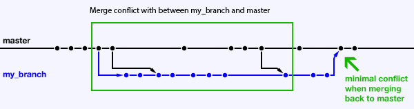
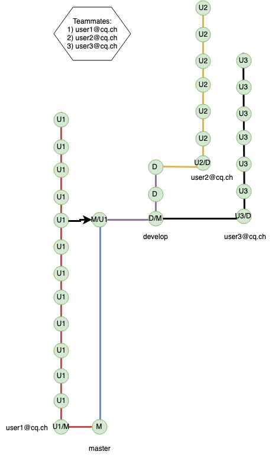
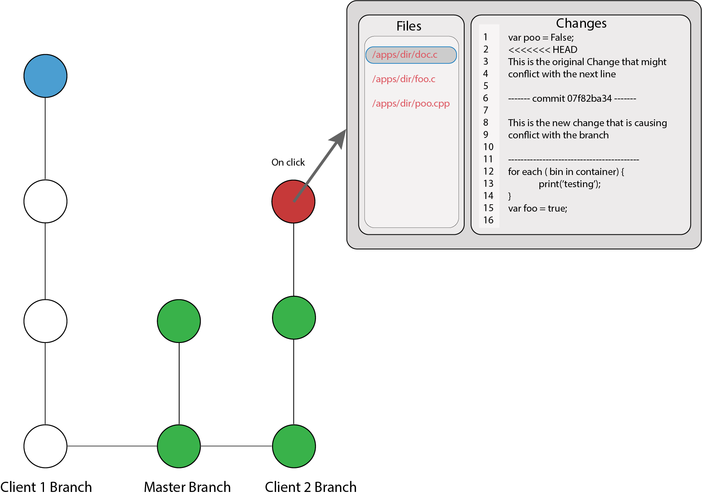

#H1
Detailed feature: prevent merge conflicts using local commits as indicators

The idea of this feature is to gather information from every team member working on a same project. This information consists of monitoring the developers environment to find out when a new commit is made. The current issue holds within cases where one or two local commits are made, and these changes have not been pushed to the remote repository, therefore the other teammates cannot see these changes in real time and thus leading to a merge conflict. 

Every time a local commit is detected, the information is sent to our middleware. The middleware contains a clone of the remote repository and creates a mirror of the branches on which the clients are working on. With the clients commit information, the branches are updated. 

By using these branches, we can test against every other branch for merge conflicts. If a conflict is found, the data is saved on our database (on which branch, on which commit, who is the branch owner) to be displayed to the client on a later stage. 

Our goal with this feature is to be able to present a graph (git-graph) where every team member can see how their colleagues compare to the HEAD of the remote repository. The graph structure is the same for the whole project. However, the leaves of the graph will change color given who is the developer.

The user case is: “As a user, which other leaves (commits) are in conflict with mine?”. By using this logic, the user can click on commits done by their teammates and assess if there is a merge conflict on a specified point. If so, which files are changed and in which lines the conflict takes place. 

An example of the shared graph can be seen here:

An example of the leaf visualization with the files changed can be seen here:

